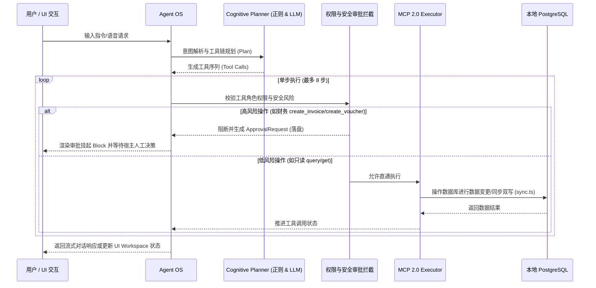

# Bambook (竹衍) v3.0 System Architecture

> "竹衍风吟，智慧蔓延。"

> **注意**: 本文档部分内容已过时。当前单一事实源为 [BUSINESS_CAPABILITY_MATRIX.md](./BUSINESS_CAPABILITY_MATRIX.md)。

> ⚠️ **2026-06-15 架构事实修订（替换原"本地内嵌后端"叙事）**
>
> 历史版本将 Electron `startEmbeddedServer()` 这条**离线降级 fallback** 错误地描述为主架构。**真实架构**是「**桌面客户端 + Mac Mini 数据中心**」**两端分离**：
>
> - **客户端**（Electron + React）：仅负责 UI 展示、交互、本地语音转文字 (sherpa-onnx STT)、数据缓存。**不持有业务真源**。
> - **数据中心**（Mac Mini，公网入口 `https://jiangsupanda.com`）：承载所有后端能力 —— PostgreSQL、Express REST、Agent Runtime（manifest/defaults/toolRuntime/planner）、LLM 网关转发、Ops Panel (`https://ops.jiangsupanda.com/ops`)、Cloudflare Tunnel。
> - **内嵌 Express**：仅当客户端无法访问 Mac Mini 时由 `electron/main.ts:481 startEmbeddedServer()` 启动作为离线 fallback，**不是日常运行模式**。
>
> 真实架构以以下两份文档为权威源：
> - [`Bambook-Agent-OS-使用说明书.md` §1](file:///Users/qinwengu/WorkBuddy/Claw/apps/Bambook/docs/Bambook-Agent-OS-使用说明书.md)（用户视角）
> - [`server/docs/macmini-data-center.md`](file:///Users/qinwengu/WorkBuddy/Claw/apps/Bambook/server/docs/macmini-data-center.md)（运维视角）
>
> 本文（架构层）已在下方更新，但其它二级章节可能仍残留旧叙事，遇到不一致以上述两份文档为准。

## 1. 系统概览

Bambook v3.0 是为 Panda Clothing 打造的「**桌面客户端 + Mac Mini 数据中心**」两端分离架构 —— 业务真源全部在公司数据中心，客户端只负责展示、交互与本地语音输入：

```
┌──────────────────────────────────────────────────────────────────────────┐
│  桌面客户端 (Electron 41 + React 19) ─ 任意员工设备，可重装/换机          │
│  ─ UI 展示 / 用户交互 / 本地 STT (sherpa-onnx) / 本地缓存 (IndexedDB)    │
│  ─ 不持业务真源；HTTP → https://jiangsupanda.com/bambook/api/v1/*        │
└────────────────────────────────┬─────────────────────────────────────────┘
                                 │  HTTPS over Cloudflare Tunnel
┌────────────────────────────────▼─────────────────────────────────────────┐
│  Mac Mini 数据中心 (公司机房，公网域 jiangsupanda.com)                    │
├──────────────────────────────────────────────────────────────────────────┤
│  Bambook Agent OS  ── manifest / defaults / toolRuntime / planner         │
│  ┌────────────┬────────────┬────────────┬──────────────────────────────┐  │
│  │  Planner   │  Defaults  │  Sandbox   │     MCP 工具集 (44 seeds)    │  │
│  │ (正则+LLM) │ (角色矩阵) │  Approval  │   (orders/finance/email/…)   │  │
│  └────────────┴────────────┴────────────┴──────────────────────────────┘  │
├──────────────────────────────────────────────────────────────────────────┤
│  主数据 API (Express + Prisma)  ─ launchctl com.bambook.main-data-api    │
│  PostgreSQL (panda_hub_local)   ─ 业务真源；ops-backup-postgres.sh 备份  │
│  Ops Panel (独立子项目, ops.jiangsupanda.com)  ─ 21 个白名单运维脚本     │
├──────────────────────────────────────────────────────────────────────────┤
│  语音/推理外部网关：火山引擎豆包（ARK）/ GLM-4（按 LLM_PROVIDER 切换）      │
└──────────────────────────────────────────────────────────────────────────┘

离线 fallback：客户端探活失败时由 electron/main.ts startEmbeddedServer()
              启动一个本地 Express + 本地 Postgres，仅维持只读体验，
              不参与业务真源同步。
```

## 2. 请求处理与 Agent 循环流 (ReAct Run Loop)



## 3. 三级记忆机制 (Memory System)

Bambook 采用高度解耦的多级记忆架构：
1. **L1 工作记忆 (Short-Term)**: 保存在当前对话 Session 状态中的历史消息，限制 8-10 轮 ReAct 消息滑动，提供实时的长上下文关联；
2. **L2 场景记忆 (Scenario Preferences)**: 保存在 `UserAccount` 中的偏好设置、角色范围与常用操作，影响 Planner 的个性化判定；
3. **L3 知识图谱与向量库 (Long-Term)**: 基于 `EntityLink` 与 `EntityReference` 构建的跨模块业务关联网络，提供全局无缝联动，并配合外部向量检索获取文档与企业洞察。

## 4. 后端核心目录结构

```text
apps/Bambook/
├── components/                # React UI 核心组件目录
├── electron/                  # Electron 桌面端主/预加载进程
├── services/                  # 前端对接后端的 REST API 请求层
├── styles/                    # 全局视觉样式定义 (.css)
└── server/                    # 后端服务
    ├── prisma/                # DDL 定义 (schema.prisma) 及数据迁移
    ├── scripts/               # 演示数据填充、E2E 回归测试等脚本
    └── src/                   # 后端业务源码
        ├── index.ts           # 后端服务主入口
        ├── agent/             # Agent 运行时 (MCP、Planner、RBAC、toolRuntime)
        ├── entities/          # 图谱同步层 (sync.ts - 双写逻辑)
        └── [modules]/         # 业务模块 API (orders, development, finance 等)
```

## 5. 核心部署要求

> 部署主路径：通过 **Ops Panel (`https://ops.jiangsupanda.com/ops`)** 一键拉取 GitHub 并部署主数据 API。详见 [`server/docs/ops-panel-runbook.md`](file:///Users/qinwengu/WorkBuddy/Claw/apps/Bambook/server/docs/ops-panel-runbook.md) 以及兜底 SOP [`docs/DEPLOY_SOP.md`](file:///Users/qinwengu/WorkBuddy/Claw/apps/Bambook/docs/DEPLOY_SOP.md)。

| 组件/服务 | 必需 | 部署位置 | 说明 |
| :--- | :---: | :--- | :--- |
| **Node.js 18+** | ✅ | Mac Mini 数据中心 | 主数据 API 运行时（launchctl `com.bambook.main-data-api`）。 |
| **PostgreSQL** | ✅ | Mac Mini 数据中心 | 业务真源数据库 `panda_hub_local`，由 `ops-backup-postgres.sh` 定时备份。 |
| **Cloudflare Tunnel** | ✅ | Mac Mini 数据中心 | 公网入口 `jiangsupanda.com` / `ops.jiangsupanda.com`。 |
| **Ops Panel** | ✅ | Mac Mini（独立 launchctl `com.bambook.ops-panel`） | 21 个白名单运维脚本一键面板。 |
| **Volcengine API Key (ARK)** | ✅ | Mac Mini 数据中心 | 由后端持有；客户端不直连大模型。 |
| **sherpa-onnx** | ✅ | 桌面客户端 | 本地离线 STT；唯一在客户端运行的 AI 组件。 |

---

## 6. 运行环境拓扑（Dev / Prod 务必区分，切勿混淆）

项目**同时存在多个前端与后端**，开发与生产环境完全隔离。任何部署 / 联调 / 造数前，必须先确认当前所处环境 —— 混淆 Dev 与 Prod 是最常见的高危失误。

### 开发测试环境（Dev，纯本地，数据可随意造）
| 形态 | 端点 / 入口 | 说明 |
| :--- | :--- | :--- |
| 开发网页版 | `http://localhost:3000` | 纯开发测试的网页版，连接本地库 |
| 开发客户端 | Electron（本地启动） | 纯开发测试的桌面客户端，连接本地库 |
| 本地数据库 | **Local Panda Hub** | 纯开发测试用的本地库，与生产正式库物理隔离，可随时重置 / 造数 |

> Dev 三件套（localhost:3000 / Electron / Local Panda Hub）共用一套本地库，**绝不可写入任何生产数据**。

### 生产真实环境（Prod，对接真实业务）
| 形态 | 端点 / 入口 | 说明 |
| :--- | :--- | :--- |
| 正式网页版 | `https://bambook.jiangsupanda.com` | 项目的正式网页版，对接真实生产 |
| 正式后端 / 数据中心 | Mac Mini 上的 `jiangsupanda.com` 后端 | 真实正式数据库后端，业务真源所在 |

> Prod 网页版（bambook.jiangsupanda.com）与 Prod 后端（Mac Mini / jiangsupanda.com）共用同一套正式数据库，**任何写入即真实业务数据**。

### 铁律
1. 本地开发（localhost:3000 / Electron）永远只连 **Local Panda Hub**；上线 / 验收才走 **bambook.jiangsupanda.com + Mac Mini 正式库**。
2. 演示数据、测试账号、假订单只允许存在于 Local Panda Hub；推生产前必须清空。
3. 不要把 Dev 端点（localhost / 本地库）误配到生产构建，也不要把生产 API Key / 库连到本地开发。

---

*Last Updated: 2026-08-21*  ｜  *新增 §6 运行环境拓扑（Dev/Prod 区分），呼应 2026-08-21 v0.8 交付决策。*
