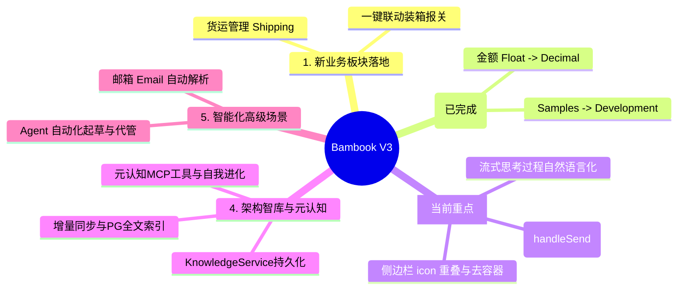

# Bambook 全栈与 Agent OS 架构优化与版图规划 (Roadmap)

## 📌 当前状态评估
我们已成功走通了“E2E 冒烟联调（优先级 1）” ➜ “确立八层模块契约与代码生成器（优先级 2）” ➜ “财务（Finance）双模型实战开发（优先级 3）”的闭环。
数据图谱已实现 **100% 纯 Demo 态下 1:1 双轨对齐（102 链接 vs 102 快照）**，Agent 可以完美执行针对关系、档案、生产、开发、财务的自然语言调度。

为了让 Bambook 迈向更加健壮的工业级系统，我们将下一个阶段的发展版图拆分为四个核心支柱。

---

## 🗺️ 核心规划五大支柱

---

## 🛠️ 任务细分与落地路径

### 支柱 1：新业务板块落地 — 货运管理 (Shipping & Logistics)
财务核销打通后，供应链的最后一个拼图是**货运与报关**。我们需要把货运从原始状态功能化。

* **L1 数据层**：设计 `Shipment`（运单/装箱单）模型，包含箱数、毛重、净重、海关HS编码、货运承运商等。
* **L3 拓扑图谱**：
  * 新增关系：`shipsVia`（运单 ➜ 货代/船公司）、`loadedWith`（运单 ➜ 订单明细行）。
  * 自动联动：录入运单时，根据订单明细自动带出产品箱规，并反向扣减大货的未发货库存。
* **L5 Agent 接入**：包装 `shipping.query`、`shipping.create_shipment`、`shipping.update_tracking_status` MCP 工具。

---

### 支柱 2：全局技术债清洗（已完成）
为了消除系统内部的一致性隐患，必须将存量模块的技术债一次性出清。

* **问题 2.1：金额精度债（`Float` ➜ `Decimal` 全局重写）— 已完成**
  * **现状**：已于 2026-06-15 完成全库金额字段从 Float 到 `Decimal @db.Decimal(18, 4)` 的重构与迁移，包含大货订单（`Order`, `OrderLine`） and 开发管理等全量历史模型。用户已在主项目中完成重新优化并已落盘，彻底消除了 IEEE 754 精度隐患。
* **问题 2.2：命名不一致债（`Samples` ➜ `Development`）— 已完成**
  * **现状**：已成功重命名 `components/SampleManager.tsx` ➜ `components/DevelopmentManager.tsx`，并将 `moduleRegistry.ts` 中 `View.Samples` 及其组件引用进行全栈重构对齐。

---

### 支柱 3：全模块前端编译化与 UX 交互重构（当前重点）
针对前端在开发环境（`Vite dev server` 端口 3000）重新载入后暴露出的核心 UX 问题进行彻底重构，理顺审批流与流式思考的交付链条：

* **问题 3.1：审批弹窗中断与 handleSend 续跑自动关联**
  * **设计**：当后端弹出“批准/拒绝”审批拦截卡片时，确保 SSE 流式对话不会被异常判定为已结束。在前端 `components/Assistant.tsx` 中添加 `resolveAgentApproval`，在用户点击“批准”后，自动调取 `handleSend` 以续跑状态机，恢复 SSE 事件通道。同时将后端提示词修改为更加人性化的自然语言。
* **问题 3.2：流式思考过程人性化/自然语言展示**
  * **设计**：废除机械的工具调用勾勾及空的渲染组件（`ProcessGroup`）。在流式过程中，思考文本直接以纯灰斜体字（`text-[13px] italic`）实时渲染输出，在完成后将具体工具折叠为链接。
* **问题 3.3：侧边栏与状态栏细节抛光 (UI Polish)**
  * **设计**：彻底清理侧边栏重命名/删除按钮与对话标题重叠、icon 外加圆角容器等低级视觉瑕疵；缩小顶部状态栏图标尺寸，去除干扰性的彩色闪烁文案，状态文字完全走 `agentEventPresentation.ts` 中的自然语言映射。
* **问题 3.4：编译静态化与性能优化**
  * **设计**：将 `OrderManager.tsx` 等页面接入 `compiledOrdersTemplates` 静态编译，优化滚动与 Spotlight 光效。

---

### 支柱 4：Bambook 架构智库同步与 Agent 元认知方案（自我认知进化） [当前重点]
为了防范“加新东西时漏了某一处”等违反契约的情形，让 Agent 具备对全局模块契约和反模式的“元认知”，我们构建基于 PG 全文索引的本地文档增量同步与查询闭环：

* **问题 4.1：`KnowledgeService` 持久化改造**
  * **现状**：当前 `KnowledgeService` 为纯内存版本，导致即使把文档写入数据库，Agent 运行时也无法感知。
  * **改造方案**：将 `createKnowledgeService` 改造为基于 Prisma 的持久化版本，或实现两者的双轨混部，确保检索操作能够真正回源数据库。
* **问题 4.2：基于相对路径与 Checksum 的增量同步脚本**
  * **现状**：架构文档物理分布在 `/docs/`、`/docs/design-system/`、`/server/docs/` 等多个目录中。
  * **改造方案**：编写独立 CLI 脚本 `scripts/sync-docs.ts`，定义严格的文件白名单，通过相对路径与 `sourceUri` 做 upsert 唯一键（`@@unique([sourceUri])`），基于对比 `checksum` 增量更新 `KnowledgeDocument`，并提供孤儿清理（Orphan Cleanup）机制。
* **问题 4.3：触发与检索选型**
  * **策略**：独立命令 `npm run docs:sync` + 后端启动非阻塞异步执行。检索首期采用 Postgres 全文索引（`tsvector` + `to_tsquery`），暂不依赖外部 Embedding API 以确保本地闭环和极致响应，后续无缝升级。
* **问题 4.4：Agent 元认知 MCP 工具与身份强化**
  * **落地**：在 MCP 端注册 `agent.search_self_architecture` 工具；在 `coreIdentity.ts` 身份声明中强制规定在进行大货订单、财务开发或结构重构前，必须主动通过此工具验证契约，从根本上防止 `TOOL_NOT_REGISTERED` 等低级失误。

---

### 支柱 5：AI 智能邮箱与 Agent 级深度代管
打通前后台以实现超出主程序本身功能的自动化：

* **邮件自动解析**：当 `EmailManager` 接收到客户的订单 PO PDF 附件或开票申请时，Agent 自动调用 `pdf-parse` 解析结构，并自动发起 `finance.create_invoice` 或 `orders.create_order` 流程，进入主程序的审批流，实现真正的“全自动大货跟单代管”。

---

## 📈 落地实施排程 (Priority Order)

| 阶段 | 任务名称 | 目标交付物 | 依赖项 | 风险度 |
| :---: | :--- | :--- | :---: | :---: |
| **Phase 1** | **金额精度债清洗 [已完成]** | `Order` 库 Float 全量转 Decimal，全库金额类型 100% 对齐（用户已在主项目中完成重新优化并落盘） | 无 | 🟢 无 |
| **Phase 2** | **开发管理命名迁移 [已完成]** | `Samples` ➜ `Development` 全栈迁移，消除命名债务 | 无 | 🟢 无 |
| **Phase 3** | **前端 UX 交互重构与验证** | 修复审批自动续跑（handleSend）、流式思考自然语言展示、侧边栏/状态栏视觉抛光，验证 Vite dev server | 无 | 🟢 低 |
| **Phase 4** | **架构智库同步与 Agent 元认知** | `KnowledgeService` 持久化，`sync-docs` 增量同步，全文检索与 MCP 自我审查工具上线 | 无 | 🟢 低 |
| **Phase 5** | **货运管理板块落地** | 依据 `scaffold-module.ts` 快速生成 Shipping 骨架并写真实业务 | 无 | 🟢 低 |
| **Phase 6** | **智能邮箱解析与代管**| 实现 PDF/Excel 自动解析并起草审批单的 Agent 链 | Phase 5 | 🟠 中 (依赖LLM稳定性) |
| **Phase 7** | **全模块 Compiled 静态编译**| 订单/开发/财务的前端组件通过编译生成高效静态模板 | 无 | 🟢 低 |
